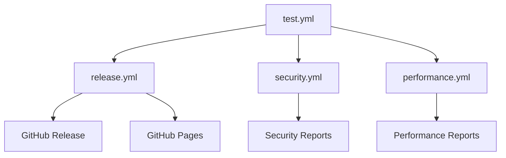

# 🚀 GitHub Workflows - Master Search

This directory contains comprehensive GitHub Actions workflows for Master Search, providing automated testing, security auditing, performance monitoring, and release management.

## 📋 Available Workflows

### 🧪 test.yml - Quality Assurance Pipeline
**Purpose:** Comprehensive testing and quality assurance  
**Triggers:** Push to main, PRs, manual dispatch  
**Features:**
- Pre-flight checks with dynamic matrix generation
- Code quality analysis (Black, isort, Flake8, Pylint)
- Security scanning with Bandit
- Multi-platform testing (Ubuntu, Windows, macOS)
- Unit and integration tests with coverage
- Build verification across platforms
- Performance benchmarks
- Compatibility matrix (Python 3.8-3.11)
- Quality gates with pass/fail determination

**Usage:**
```bash
# Automatic on push/PR
git push origin main

# Manual trigger with extended tests
gh workflow run test.yml -f run_extended_tests=true
```

### 🚀 release.yml - Release & Deploy Pipeline
**Purpose:** Automated release management and deployment  
**Triggers:** Git tags (v*), manual dispatch  
**Features:**
- Release validation and version management
- Full test suite integration
- Multi-platform build artifacts (Windows MSI, macOS DMG, Linux source)
- Automated changelog generation
- GitHub release creation with bilingual documentation
- GitHub Pages deployment
- Post-release task management

**Usage:**
```bash
# Automatic release on git tag
git tag -a v2025.11.11 -m "Release v2025.11.11"
git push origin v2025.11.11

# Manual release
gh workflow run release.yml \
  -f version=2025.11.11 \
  -f release_type=minor \
  -f prerelease=false \
  -f generate_builds=true \
  -f deploy_docs=true
```

### 🔒 security.yml - Security Audit Pipeline
**Purpose:** Comprehensive security analysis and monitoring  
**Triggers:** Daily schedule, push to main, PRs, manual dispatch  
**Features:**
- Bandit security linter for Python code
- Safety dependency vulnerability scanning
- Semgrep security pattern analysis
- CodeQL static analysis
- Dependency license compliance check
- Secrets detection with TruffleHog
- Comprehensive security reporting

**Usage:**
```bash
# Manual security audit
gh workflow run security.yml
```

### ⚡ performance.yml - Performance Monitoring
**Purpose:** Performance testing and optimization analysis  
**Triggers:** Weekly schedule, code changes, manual dispatch  
**Features:**
- Performance baseline benchmarking
- Memory profiling and leak detection
- Load testing with concurrent users
- Resource usage monitoring
- Performance regression detection
- Comprehensive performance reporting

**Usage:**
```bash
# Manual performance test
gh workflow run performance.yml \
  -f benchmark_mode=comprehensive \
  -f profile_memory=true
```

## 🎯 Workflow Integration

### Dependency Chain


### Quality Gates
All workflows implement quality gates to ensure code quality:

1. **Code Quality Gate** (test.yml)
   - Linting score > 8.0
   - Security scan passes
   - All tests pass
   - Coverage > 80%

2. **Security Gate** (security.yml)
   - No high-severity vulnerabilities
   - License compliance
   - No exposed secrets
   - Static analysis passes

3. **Performance Gate** (performance.yml)
   - Memory usage < 100MB increase
   - Search time < 5s for standard operations
   - Load test success rate > 95%

## 📊 Monitoring & Reporting

### Artifacts Generated
- **Test Reports:** Coverage reports, test results, quality metrics
- **Security Reports:** Vulnerability scans, license reports, security analysis
- **Performance Reports:** Benchmarks, memory profiles, load test results
- **Release Artifacts:** Platform-specific builds, documentation, changelogs

### Notifications
- **Success:** Release notifications, security status updates
- **Failures:** Issue creation for failed workflows, detailed error reporting
- **Schedules:** Daily security audits, weekly performance reviews

## 🔧 Configuration

### Environment Variables
```yaml
PYTHON_VERSION: '3.11'          # Python version for all workflows
```

### Secrets Required
```yaml
GITHUB_TOKEN: ${{ secrets.GITHUB_TOKEN }}  # Automatic GitHub token
```

### Permissions
```yaml
contents: write          # Repository content access
security-events: write   # Security scanning results
pages: write            # GitHub Pages deployment
id-token: write         # OIDC token for deployments
issues: write           # Issue creation for notifications
pull-requests: write    # PR status updates
```

## 🚀 Getting Started

### 1. Enable Workflows
Workflows are automatically enabled when this directory exists in your repository.

### 2. Configure Branch Protection
Set up branch protection rules for main branch:
```bash
gh api repos/:owner/:repo/branches/main/protection \
  --method PUT \
  --field required_status_checks='{"strict":true,"checks":[{"context":"Quality Assurance Pipeline"}]}' \
  --field enforce_admins=true \
  --field required_pull_request_reviews='{"required_approving_review_count":1}'
```

### 3. Set Up GitHub Pages
Enable GitHub Pages in repository settings for documentation deployment.

### 4. Monitor Workflow Runs
```bash
# List workflow runs
gh run list

# View specific workflow
gh run view <run-id>

# Download artifacts
gh run download <run-id>
```

## 📈 Performance Optimization

### Workflow Optimization
- **Parallel Execution:** Jobs run in parallel where possible
- **Conditional Execution:** Workflows skip unnecessary steps
- **Artifact Caching:** Dependencies and build outputs cached
- **Matrix Strategy:** Efficient testing across multiple configurations

### Resource Management
- **Runners:** Uses GitHub-hosted runners for cost efficiency
- **Timeouts:** All jobs have reasonable timeout limits
- **Retention:** Artifacts cleaned up automatically after 30 days

## 🐛 Troubleshooting

### Common Issues

#### Workflow Fails on Dependencies
```bash
# Check dependency conflicts
pip check

# Update requirements
pip freeze > requirements.txt
```

#### Permission Errors
```bash
# Verify repository settings
gh api repos/:owner/:repo --jq '.permissions'
```

#### Performance Test Failures
```bash
# Run local performance test
python -m pytest performance_tests/ -v
```

### Debug Mode
Enable debug logging for workflows:
```yaml
env:
  ACTIONS_STEP_DEBUG: true
  ACTIONS_RUNNER_DEBUG: true
```

## 📋 Maintenance

### Weekly Tasks
- [ ] Review security audit results
- [ ] Check performance regression reports
- [ ] Update dependencies if needed
- [ ] Monitor workflow execution times

### Monthly Tasks
- [ ] Evaluate workflow efficiency
- [ ] Update action versions
- [ ] Review and optimize test coverage
- [ ] Clean up old artifacts

### Release Tasks
- [ ] Run full test suite
- [ ] Execute security audit
- [ ] Generate performance baseline
- [ ] Create release documentation
- [ ] Deploy to production

## 🔗 References

- [GitHub Actions Documentation](https://docs.github.com/en/actions)
- [Workflow Syntax](https://docs.github.com/en/actions/using-workflows/workflow-syntax-for-github-actions)
- [Security Best Practices](https://docs.github.com/en/actions/security-guides)
- [Performance Optimization](https://docs.github.com/en/actions/using-workflows/about-workflows#creating-dependent-jobs)

---

**Maintained by:** Loony2392  
**Contact:** b.kolb@loony-tech.de  
**Company:** LOONY-TECH  

© 2025 LOONY-TECH - All rights reserved